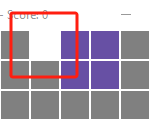
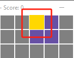
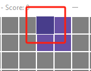
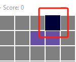

# Tetris RL-DQN Usage 

## File Structure 

- **RL_DNQ_Tetris.py** 

  RL-DQN Model applied on OpenAI Gym Environment & Atari 2600 Tetris ROM

- **TetrisGame.py**

  The main file of a rewritten Tetris game with different features 

- **TetrisModel.py**

  Game algorithm of a rewritten Tetris game with different features 

## Running the Game

**Pre-requisites:** Python 3.9-3.11, with `pygame` and `numpy` packages.

```shell
# To install pygame and numpy, run the following command
pip install pygame numpy
```

**Starting the game:** Run `Tetris

## Game Elements

- **TetrisPiece** -- A shape that is to be drop

- **TetrisPoint** -- A single block of a `TetrisPiece`

- ​    **Picker**      -- Modify Current `TetrisPiece` by moving its `TetrisPoint `

## Movement 

- **space** : Drop `TetrisPiece`
- ​    **z**      : Pick/Unpick `TetrisPoint`
-    **up**     : Move up ` Picker `
- **down**  : Move down `Picker `
-   **left**    : Move left  `Picker` 
-  **right**  : Move Right  `Picker`

## Picker status

- White: Not on`TetrisPoint` (status 0) 




- Yellow: On `TetrisPoint` & Not picked (status 1)




- Blue: `TetrisPoint` Picked & Moving picked `TetrisPoint` (Status 2)




- Dark Blue: `TetrisPoint` Stacked & Moving picked `TetrisPoint` (Status 3)



